<p align="center">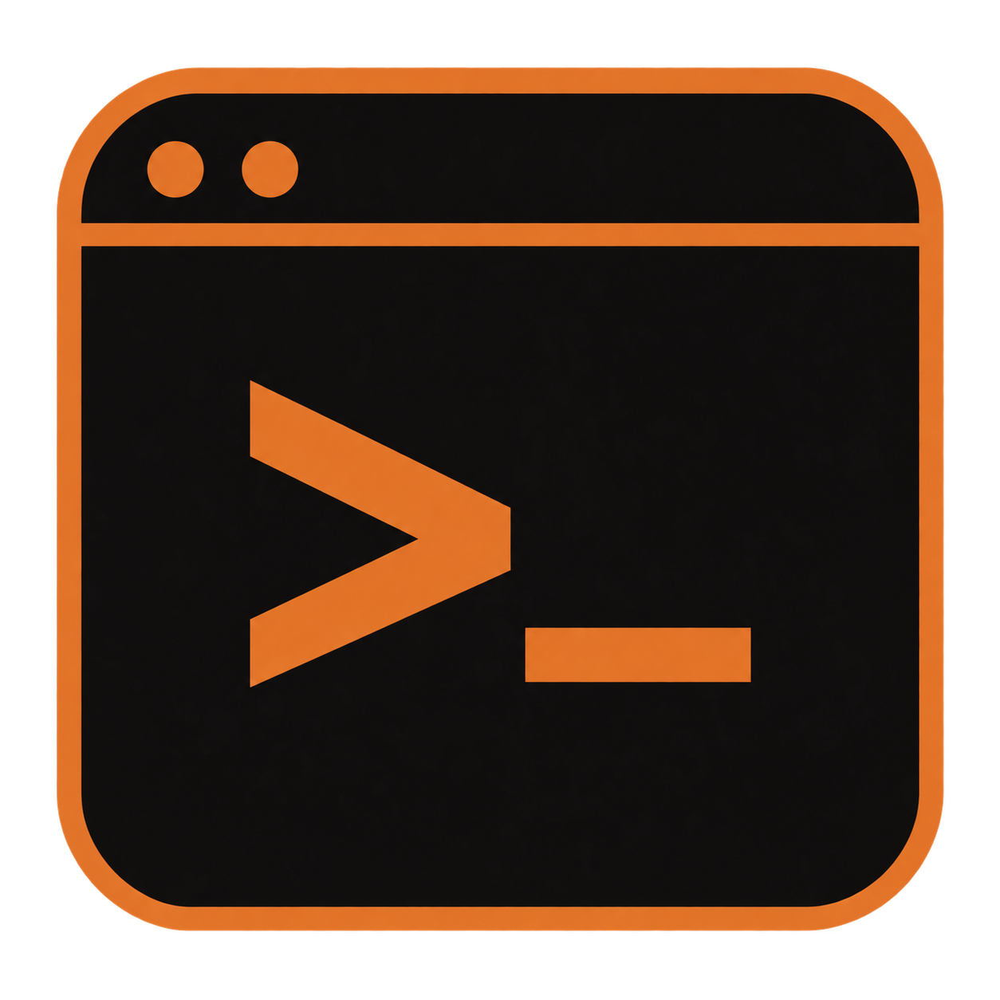</p>

# wShell

**가볍게 열고, 여러 서버를 한 창에서.** Windows x64와 macOS용 네이티브 터미널입니다.
탭 작업 공간, 공개 Flexoki Dark 팔레트와 JetBrains Mono를 사용합니다. Created by **Hyunwook Park**.

**현재 작업 범위 (2026-10-08): Windows 로컬 빌드에 집중합니다.** GitHub Actions 포함 사용량 소진으로 push·PR 자동 빌드는 중단하고, CI는 명시적으로 요청할 때만 수동 실행합니다. macOS·iPad 빌드 중단도 유지합니다. [개발 규칙](rules/development.md#현재-작업-범위--windows-집중)

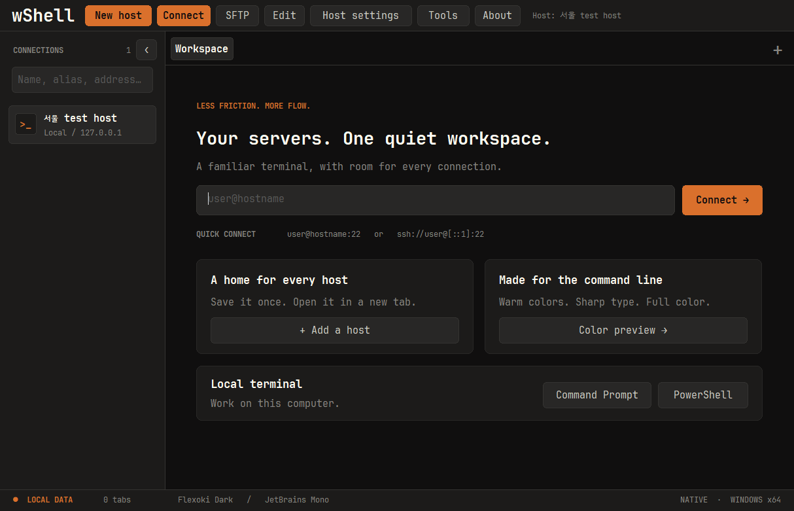

## 분할 보기

여러 탭을 연 뒤 **Split**에서 2·3·4분할을 선택합니다. 영역을 클릭하면 입력 대상이 바뀌며, **Single pane**으로 돌아가도 연결은 유지됩니다. Windows `Ctrl+Shift+S`, Mac `⌘⇧S`. [자세한 사용법](docs/split-view.md)

Windows 0.9.1에서는 실제 키보드 입력을 받는 영역의 커서와 주황색 테두리가 깜빡이며 **ACTIVE**로 표시됩니다. 하단 명령창을 편집하는 동안에는 전송 대상만 **SELECTED**로 표시하고 테두리 깜빡임을 멈춥니다. 분할을 선택한 직후 바로 입력할 수 있고, 터미널 본문을 클릭하면 포커스가 돌아옵니다. **Zoom / Back** 또는 `Ctrl+Shift+Enter`로 현재 영역을 확대하고 원래 분할로 복귀합니다. `Ctrl+Alt+방향키`로 인접 영역에 포커스를 옮깁니다.

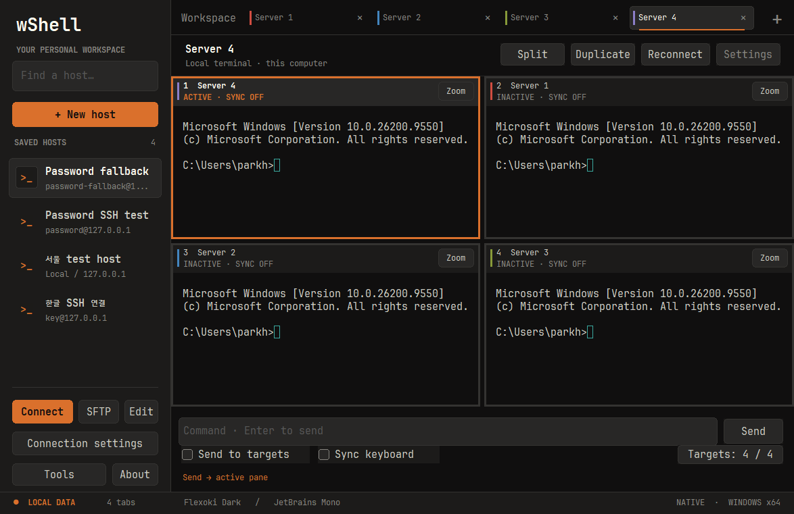

## 호스트 별칭·색상과 공통 입력

Windows·Mac의 호스트 편집 화면에서 **Alias**와 **Tab color**를 지정합니다. 별칭과 색상은 탭과 분할 영역을 구분하며 설정 백업에도 포함됩니다.

Windows 0.13.0부터 지정한 색상을 **탭 상단 전체 색상 띠와 배경**에 표시합니다. 활성 탭은 주황색 외곽선·하단 표시와 굵은 이름으로 구분합니다.

분할 화면 하단에 명령을 입력하고 Enter 또는 **Send**를 누르면 현재 영역으로 보냅니다. Windows는 **Targets**에서 대상을 선택하고 **Send to targets**를 체크하면 선택한 영역에 보냅니다. Mac은 기존 **Send to all panes**를 사용합니다. **Sync keyboard**는 터미널에서 타이핑·방향키·Backspace·Ctrl+C·붙여넣기를 동시에 전달하는 별도 옵션입니다.

Windows에서 **Sync keyboard** 또는 `Ctrl+Shift+B`를 누르면 활성 터미널로 포커스가 돌아갑니다. 그 터미널 안에서 방향키·Home/End·Delete로 여러 창을 함께 편집합니다. 공통 명령창의 방향키는 보내기 전 초안만 편집하며, `Ctrl+Shift+K`로 명령창에 이동합니다. **Targets**에서 제외한 영역은 독립적으로 입력할 수 있습니다. 서로 다른 셸·편집기 내용의 커서 좌표 자체를 일치시키는 기능은 아닙니다.

두 옵션은 기본 해제이며 분할 대상이 바뀌면 해제됩니다. Windows는 확대/복귀와 재연결 시에도 해제합니다. 숨겨진 탭·SFTP·인증 중인 연결은 제외합니다. 자세한 범위와 플랫폼 차이는 [분할 입력 사용법](docs/split-view.md), 변경 내역은 [0.9.1 릴리스 노트](docs/releases/0.9.1.md)를 확인하세요.

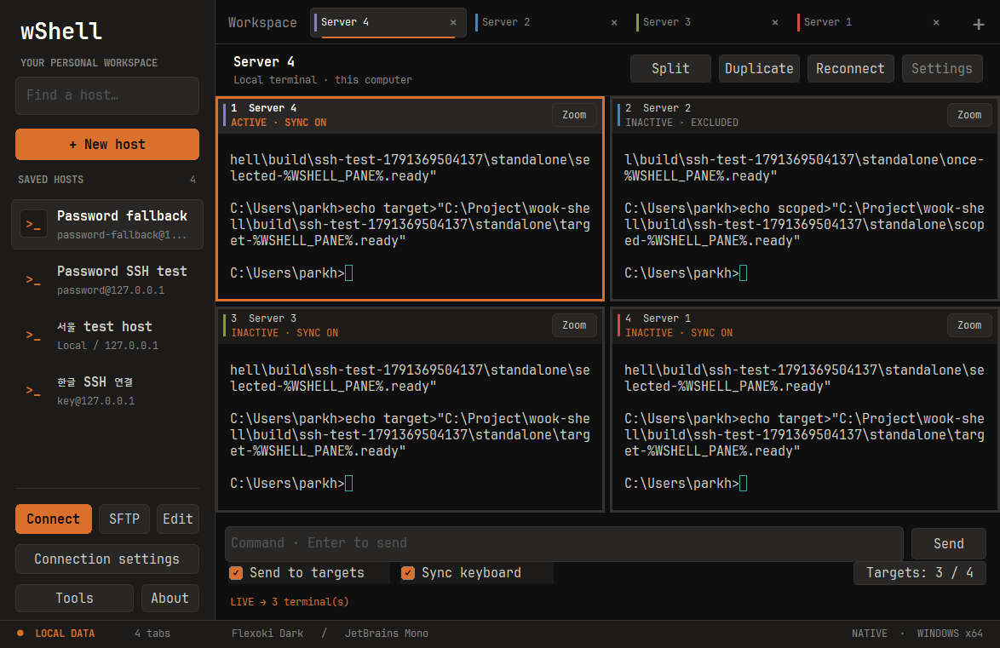

## iPad 개인용 미리보기

iPad용 네이티브 SSH·SFTP 앱은 별도로 준비 중입니다. 무료 Apple 계정으로 설치할 수 있으며, unsigned IPA의 로컬 서명과 7일 주기 갱신이 필요합니다. 이 저장소에도 `.github/workflows/ipad.yml`과 `rules/ipad.md`가 있습니다. [기능·빌드·설치 안내](docs/ipad.md), [iPadOS 26.6·Derpy 검토와 자동 갱신](docs/ipad-signing.md)

## 실행하기

### Windows

1. **[`wShell.exe`](dist/0.13.0/windows-x64/wShell.exe) 하나**를 원하는 폴더에 복사합니다. [`wshell-0.13.0-windows-x64.zip`](dist/0.13.0/windows-x64/wshell-0.13.0-windows-x64.zip)에도 이 파일만 들어 있습니다. GitHub 파일 화면의 **Download raw file**로 받습니다.
2. 실행합니다. 설치, 관리자 권한, WebView2, .NET, Node.js가 필요하지 않습니다.
3. `New host`에서 접속 정보를 저장하거나, 빠른 연결 칸에 `user@hostname:22`를 입력합니다.
4. 처음 접속하는 SSH 서버의 키 지문을 확인한 뒤 신뢰 여부를 선택합니다.

대상: Windows 10 1903 이상 / Windows 11, x64. 터미널 엔진·폰트·브랜딩·라이선스를 EXE 안에 포함합니다. 내장 폰트는 `%LOCALAPPDATA%\wShell\fonts`에 검증된 파일로 캐시하고 앱 프로세스에만 등록하므로, JetBrains Mono가 설치되지 않은 PC에서도 Windows 글꼴 선택 창을 사용할 수 있습니다. 폰트 다운로드·시스템 설치·관리자 권한은 필요하지 않습니다. 현재 배포본에는 코드 서명이 없습니다.

### macOS

1. `wshell-0.11.0-macos-universal.zip`을 풀고 **`wShell.app`**을 실행합니다. Applications 폴더로 옮겨도 됩니다.
2. macOS 13 이상에서 Apple Silicon·Intel을 모두 지원하는 Universal 앱입니다. 별도 런타임이나 WebView 설치가 필요하지 않습니다.
3. `New host`로 SSH 서버를 추가하거나 `Open Terminal`로 현재 Mac의 로그인 셸을 엽니다.

macOS 배포본은 ad-hoc 서명 상태이며 **Apple Developer ID 서명·공증은 아직 없습니다**. 다운로드한 앱의 첫 실행은 Gatekeeper가 차단할 수 있습니다. 출처를 확인한 경우 시스템 설정의 개인정보 보호 및 보안에서 해당 앱 실행을 허용해야 합니다.
macOS의 `.app`은 Finder에서 하나의 앱으로 이동하는 번들이며, 내부 실행파일만 꺼내 사용하는 형태는 아닙니다.

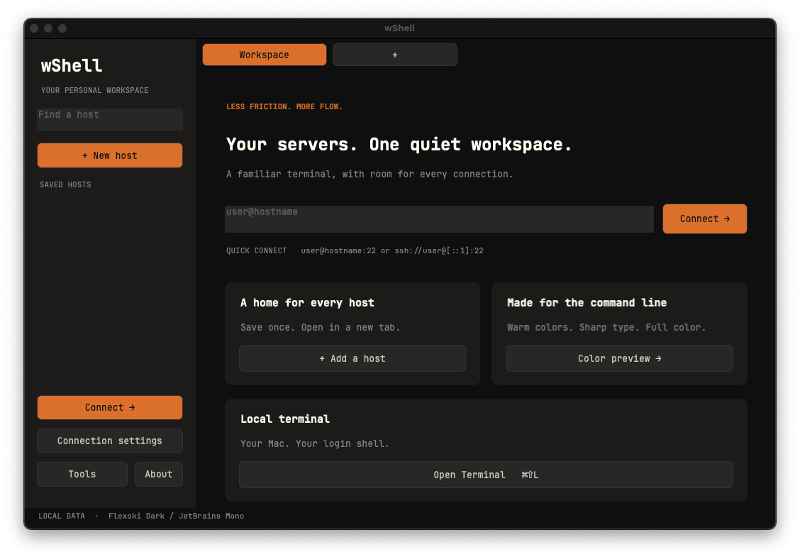

### 버전별 배포

루트 `VERSION`에서 앱·패키지 버전을 관리합니다. **0.13.0은 Windows 배포**입니다. 실행파일·ZIP·SHA-256·manifest를 Git의 `dist`에 버전별로 보관하며 [전체 다운로드 목록](dist/README.md)에서 이전 버전도 받을 수 있습니다. 새 배포 manifest에는 빌드 소스 커밋을 기록하며, CI에서 빌드한 경우에만 실행 링크를 추가합니다. 기존 0.13.0은 CI 검증 완료본이고 이후 배포는 로컬 빌드·검증을 기본으로 합니다. macOS는 기존 0.11.0, iPad는 기존 unsigned 0.1.0 산출물을 보관하며 새로 빌드하지 않습니다. [0.13.0 변경 내역](docs/releases/0.13.0.md)

```text
dist/
  README.md
  0.13.0/
    manifest.json
    windows-x64/
      wShell.exe
      wShell.exe.sha256
      wshell-0.13.0-windows-x64.zip
      wshell-0.13.0-windows-x64.zip.sha256
  0.11.0/
    macos-universal/
      wshell-0.11.0-macos-universal.zip
      wshell-0.11.0-macos-universal.zip.sha256
  ipad/0.1.0/
    wshell-ipad-0.1.0-unsigned.ipa
    wshell-ipad-0.1.0-unsigned.ipa.sha256
```

| 기능 | Windows | macOS |
| --- | --- | --- |
| SSH 비밀번호·공개키 인증, 컬러 터미널, 탭 | 지원 | 지원 |
| SFTP 전용 탭 | 로컬·원격 목록, 파일 업로드/다운로드 | 동일 |
| 로컬 셸 | CMD 기본 / PowerShell 선택 | 시스템 로그인 셸(zsh 등) |
| 저장 비밀번호 | 현재 Windows 계정 DPAPI | 이 Mac의 로그인 Keychain, 동기화 제외 |
| 키 생성 | Ed25519 / RSA, 자체 키 관리자 | Ed25519 / RSA, OS ssh-keygen을 앱 내 터미널에서 실행 |
| 개인키 파일 | PPK, OpenSSH·PEM 가져오기와 키 목록 등록 | OpenSSH 형식 |
| 고급 PuTTY 설정 / Serial·Telnet·Rlogin·Raw | 지원 | 이번 macOS 버전에서는 미지원 |
| 설정 백업 | `.wshell`, 암호·개인키 제외 | 같은 형식; 호스트 목록 교환 가능 |
| 분할·공통 명령·키보드 동기화 | 지원 | 지원 |
| 개별 동기화 대상 선택·활성 테두리·Zoom/Back | 0.9.0에서 추가 | 기존 분할 UI 유지 |
| 탐색창 접기·고정 상단 메뉴·새 터미널 9pt | 0.10.0에서 추가 | 기존 UI·13pt 유지 |
| 탭 축소·좌우 스크롤·전체 탭 목록 | 0.11.0에서 추가 | 기존 탭 UI 유지 |
| SSH 실행 인자로 호스트 등록·즉시 접속 | 0.11.0에서 추가 | 미지원 |

macOS는 AppKit·SwiftTerm과 OS의 OpenSSH를 사용합니다. SSH 설정 파일·에이전트·공유 연결은 별도로 사용하지 않으며 호스트 키 저장소도 wShell 전용입니다. Windows와 macOS 엔진의 호스트 신뢰 형식은 서로 다르므로 플랫폼을 바꾸면 지문을 다시 확인하세요. PPK 파일을 OpenSSH 개인키로 자동 변환하지 않습니다.
macOS의 첫 접속은 비밀번호 공급 전에 서버 키 지문을 별도 화면에서 확인합니다. 확인한 키와 다른 키가 제시되면 연결을 거부합니다.

## Windows 탐색과 상단 메뉴

**CONNECTIONS 옆 ‹ 버튼** 또는 `Ctrl+Shift+H`로 왼쪽 목록을 접고 펼칩니다. 접어도 왼쪽의 좁은 탐색 영역에 **› 버튼**이 남아 바로 펼칠 수 있습니다. 버튼의 툴팁은 **Hide hosts / Show hosts**입니다. 다음 실행에도 표시 상태를 기억하며, 분할 창·명령 초안·키보드 동기화 대상과 옵션은 그대로 유지됩니다. `Ctrl+Shift+P`는 숨긴 탐색창을 펼치고 검색 칸으로 이동합니다.

**New host · Connect · SFTP · Edit · Host settings · Tools · About**은 상단에 고정됩니다. 호스트 작업은 목록에서 선택한 저장 연결을 대상으로 하며, 버튼에 마우스를 올리면 대상 이름과 주소를 확인할 수 있습니다. 세션 도구 모음의 **Files / Settings**는 현재 활성 탭에 적용됩니다.

검색 안내는 **Name, alias, address…**이며 이름·별칭·주소·그룹·사용자를 검색합니다. 선택할 결과가 없으면 Connect·SFTP·Edit이 비활성화됩니다. [0.10.0 변경 내역](docs/releases/0.10.0.md), [작업 공간 UI 규칙](rules/workspace-ui.md)


## Windows 연결과 탭

0.11.0부터 탭이 늘면 폭을 줄이고, 최소 폭에 도달하면 **‹ / ›** 버튼과 휠 스크롤을 제공합니다. 탭 줄의 **3–5 / 32 ▾** 같은 표시는 현재 보이는 범위와 전체 개수입니다. 이 버튼을 누르면 숨겨진 탭까지 전체 이름·주소로 선택할 수 있습니다. `Ctrl+Tab` 전환·새 탭·창 크기 변경 시 선택한 탭이 자동으로 보입니다. 탭 줄만 스크롤할 때에는 현재 연결과 분할 입력 대상이 유지됩니다. [0.11.0 변경 내역](docs/releases/0.11.0.md)

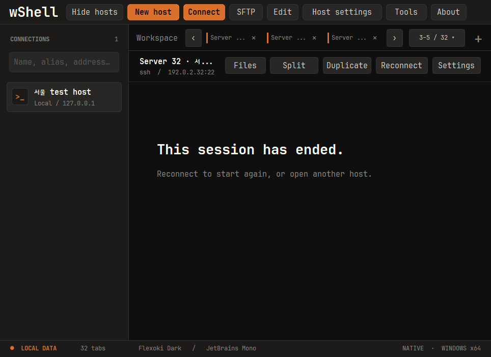

탭 우클릭에서 **Close other tabs**(이 탭만 남기기), **Close tabs to the right**(오른쪽 탭 닫기), **Close all tabs**(모두 닫기)를 사용할 수 있습니다. 전체 탭 메뉴에도 나머지·모두 닫기가 있습니다. 실행 중인 연결을 닫을 때에는 한 번만 확인하며, 취소하면 탭과 분할·명령 초안을 유지합니다. [0.12.0 변경 내역](docs/releases/0.12.0.md)

닫기 확인의 기본 선택은 **Close**입니다. **Don't ask again when closing tabs**를 체크하고 닫으면 다음부터 개별·일괄 탭 닫기를 확인 없이 실행합니다. 취소하면 이 설정도 바뀌지 않습니다. **Tools → Application settings → Confirm before closing tabs**를 체크하고 **Save**하면 확인창을 복원합니다. 앱 전체를 종료할 때의 확인은 별도입니다.

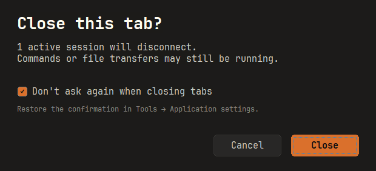

### 실행 인자로 SSH 접속

```powershell
.\wShell.exe -ssh deploy@192.0.2.10 -P 2222 -pw "<password>"
.\wShell.exe --host 192.0.2.10 --user deploy --port 2222 --name "개발 서버"
.\wShell.exe --help
```

같은 주소·포트·계정의 호스트가 있으면 그대로 재사용하고, 없으면 저장 후 접속합니다. `--name`은 새 호스트의 저장 이름입니다. 그 이름이 다른 연결에 사용 중이면 덮어쓰지 않고 오류를 표시합니다. 이름·IP·계정은 별개로 지정할 수 있으며 `ssh://user@[IPv6]:port`도 지원합니다. 이 기능은 Windows의 SSH 접속용으로, PuTTY의 모든 실행 옵션을 지원하지는 않습니다.

`-pw` 또는 `--password`는 이번 접속에 한 번만 사용하고 기존 저장 암호를 변경하지 않습니다. 재접속·복제에도 계속 사용하려면 Edit에서 암호 저장을 명시적으로 선택하세요. 최초 실행 인자의 암호는 프로세스 목록·셸 기록에 남을 수 있습니다. 자동화에서는 **`--password-stdin`으로 UTF-8 파이프 입력**을 사용하거나 암호 인자를 생략하고 터미널에서 입력하세요. 앱은 암호를 자식 프로세스 인수·환경변수·평문 파일에 재전달하지 않습니다. 처음 보는 서버의 키 지문 확인과 불일치 차단은 그대로 유지됩니다.

### 파일 전송

**SFTP:** SSH 호스트를 선택하고 `SFTP`를 누르면 로컬·원격 파일 목록을 나란히 볼 수 있습니다. 여러 파일 전송, 진행률·취소, 폴더 생성·이름 변경·삭제를 지원합니다. Windows SSH 탭의 `Files`, macOS의 `Tools → Open SFTP`에서도 열 수 있습니다. 폴더 전체 재귀 전송·동기화는 아직 지원하지 않습니다. [사용법과 지원 범위](docs/sftp.md)를 확인하세요.

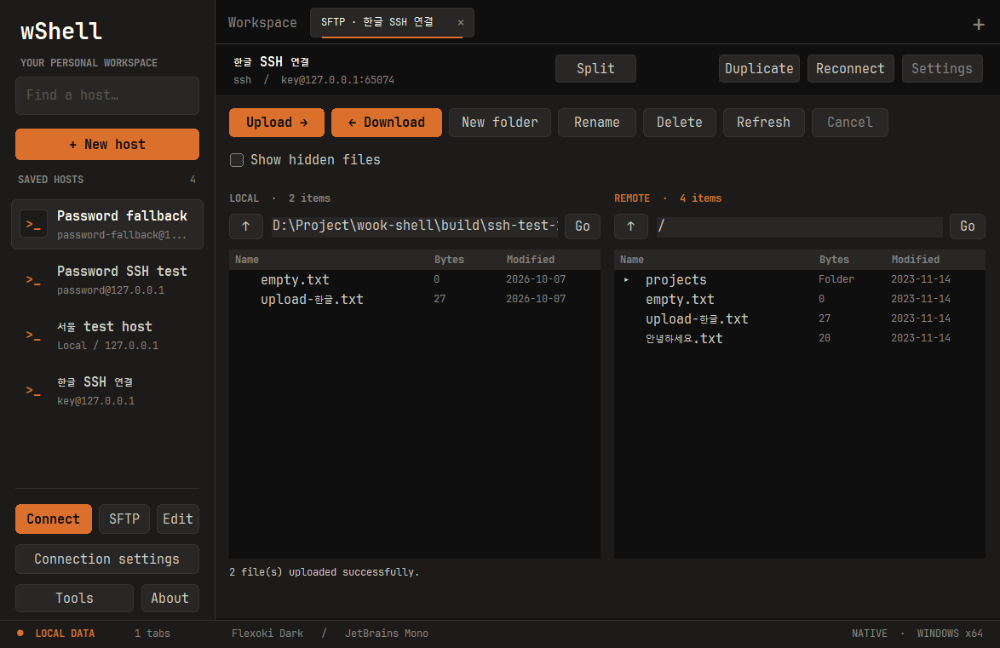

- **호스트 관리:** 저장·편집·복제·삭제, 이름/별칭/주소/그룹/사용자 검색, 더블 클릭으로 연결.
- **탭:** 새 연결, 독립 세션 복제, 드래그 재정렬, 가운데 클릭으로 닫기, 연결 재시작.
- **터미널:** UTF-8/한글, ANSI·256색·24비트 True Color, 선택/복사/붙여넣기, 10,000줄 스크롤백, 전체 화면.
- **연결 설정:** 상단 `Host settings`에서 프록시, SSH 터널, X11 전달, 키 인증, 로깅, 키보드/터미널 설정을 사용합니다. 설정 이름이나 항목으로 검색할 수 있으며, 긴 페이지는 스크롤합니다. 연결 중에는 `Settings`에서 변경하고 `Apply changes`로 적용하거나 `Cancel`로 취소하세요.
- **프로토콜:** SSH, Telnet, Rlogin, Raw TCP, Serial. Serial은 `New host`에서 COM 포트와 전송 속도를 지정합니다.
- **도구:** 자체 SSH 키 관리, 설정 내보내기/가져오기, 데이터 폴더 열기, 내장 라이선스 보기, 탭 목록 선택.
- **미리 보기:** `Color preview`는 서버 연결 없이 실제 터미널 엔진의 색상을 보여 줍니다.
- **로컬 셸:** 홈 또는 `Tools`에서 `Command Prompt` / `PowerShell`을 엽니다. `Ctrl+Shift+L`은 CMD를 열며, 탭 복제·전환·종료도 사용할 수 있습니다. ConPTY를 통해 이 PC의 명령을 실행하며 기본 작업 폴더는 현재 사용자의 홈입니다.

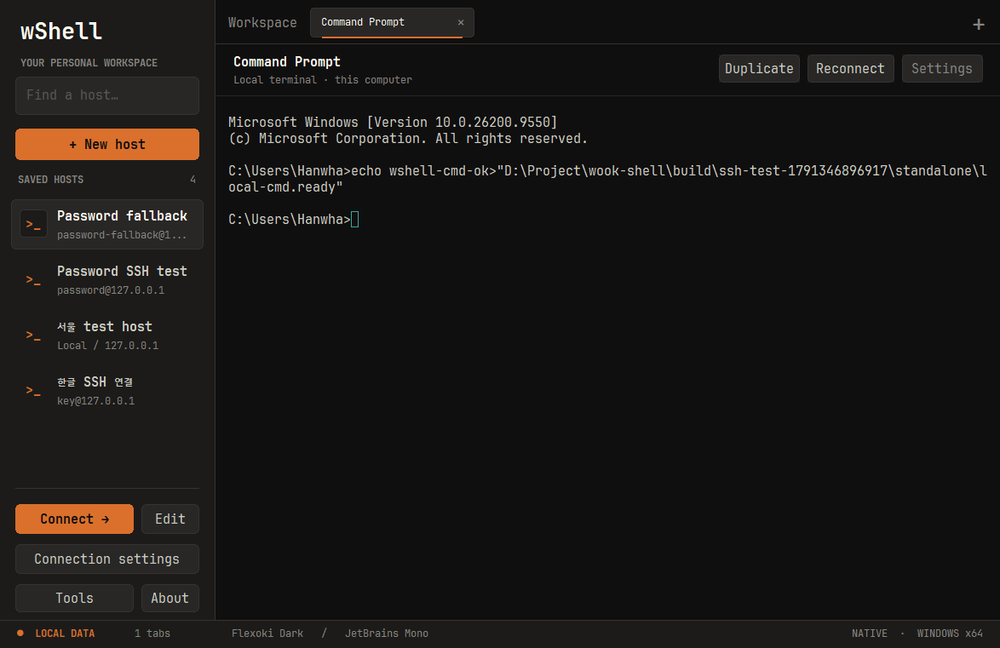

각 탭은 같은 `wShell.exe`의 별도 프로세스로 연결을 관리합니다. PuTTYgen, Pageant나 설치된 SSH 서비스에 의존하지 않으며, 외부 에이전트 인증·에이전트 전달·연결 공유는 사용하지 않습니다.
연결 설정·세션 설정·호스트 인증기관 관리 창은 wShell의 Flexoki Dark 화면을 사용합니다. 기존 엔진의 설정과 검증 로직을 유지하면서 탐색, 검색, 입력, 버튼과 스크롤을 새로 구성했습니다.

앱의 글꼴은 **JetBrains Mono Regular/Bold**로 통일했습니다. 본문·입력·버튼 11pt, 보조 정보 9pt, 섹션 제목 13pt, 페이지 제목 20pt를 공통으로 적용합니다. Windows 새 터미널의 기본 크기는 **9pt**이며 호스트별로 조절할 수 있습니다. 기존 저장 크기는 유지합니다. macOS 기본 크기는 13pt입니다. Windows의 파일 선택창 등 시스템 대화상자는 OS 설정을 따릅니다.
버튼·선택·포커스 강조색은 따뜻한 주황색 `#DA702C`입니다. 앱과 설정 화면의 왼쪽 상단에는 `wShell` 텍스트만 표시합니다. 실행파일 아이콘은 단색 주황색 `w`이며, 터미널의 ANSI·True Color 출력은 기존 색상을 유지합니다.

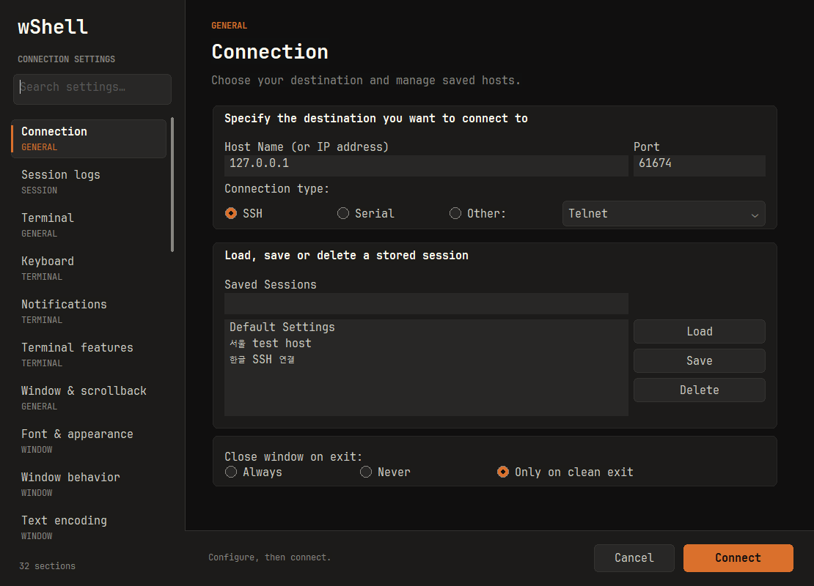

## 한글 입력 보정

Windows에서는 한글 조합을 별도 팝업 대신 **터미널 커서 자리**에 표시합니다. 터미널과 같은 글꼴·크기·배경을 사용하며, 조합 중인 글자는 주황색 밑줄로 구분합니다. 한글은 두 칸 폭에 맞추고 창 크기·커서 위치를 따라 이동합니다. SSH와 로컬 CMD/PowerShell에 별도 설정 없이 적용됩니다.

조합 중인 글자는 화면에만 표시하며 확정된 글자만 전송합니다. 탭을 옮길 때는 기존 탭에서 조합을 마무리합니다. 한자 등 후보 선택창은 Windows 기본 기능을 유지하며 조합 위치에 맞춰 배치합니다. macOS도 조합 밑줄·선택 범위와 attributed 확정 문자열을 처리합니다. JetBrains Mono에 없는 한글 글리프는 OS 글꼴로 보완합니다.

자동 검증은 합성 조합 이벤트·취소·한글 폭·리사이즈와 실제 루프백 SSH의 한글/이모지 전송을 포함합니다. OS 입력기별 실제 타이핑·후보창 동작은 [수동 확인 절차](docs/ime-input.md)를 따릅니다. 서버의 문자 인코딩이나 셸 편집 동작은 변경하지 않습니다.

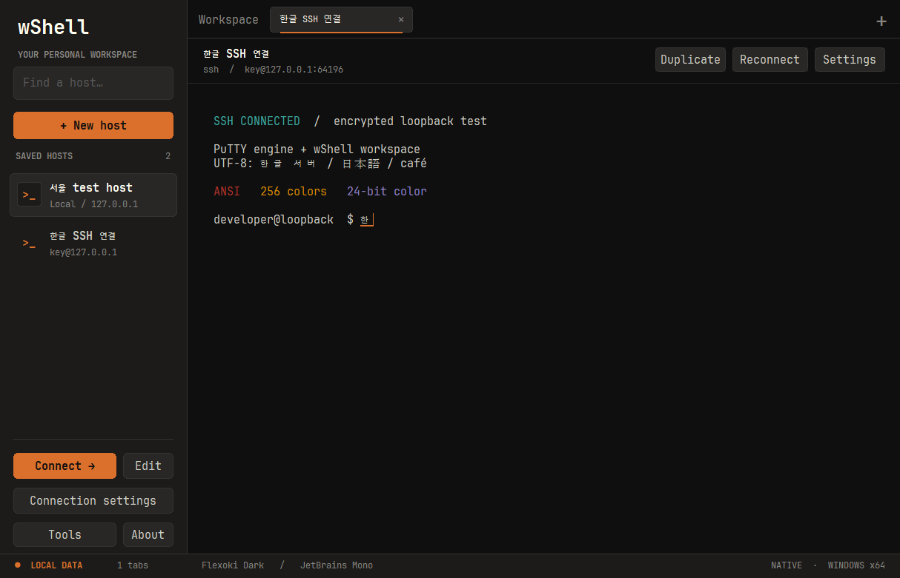

## 공개키 인증과 SSH 키 관리

SSH의 **공개키 인증은 키 쌍을 사용**합니다. 서버의 `~/.ssh/authorized_keys`에 공개키(`.pub`)를 등록하고, wShell은 대응하는 개인키로 서명합니다. 공개키 파일만으로는 로그인할 수 없습니다. 외부 에이전트의 키는 사용하지 않습니다.

`Authentication → Public key authentication`을 선택하고 개인키 경로를 지정하세요. Windows는 PPK뿐 아니라 **OpenSSH 및 기존 PEM 형식의 `.key`·`.pem` 개인키**를 가져올 수 있습니다. 호스트를 저장하거나 접속할 때 PPK 사본을 등록하며, **Choose or import a registered key → Use key**로 다른 호스트에서도 재사용합니다. macOS는 기존 OpenSSH 경로를 사용합니다. 개인키는 서버에 업로드하지 마세요.

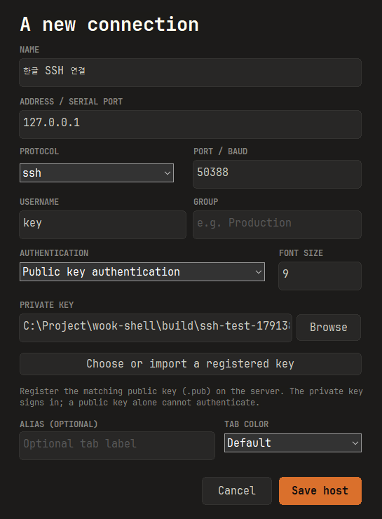

`No supported authentication methods available (server sent: publickey,gssapi-keyex,gssapi-with-mic)`가 나오면 서버가 비밀번호 인증을 제공하지 않는 상태입니다. 올바른 사용자 이름과 해당 사용자에 등록된 공개키의 **짝이 되는 개인키**를 확인하세요. Oracle에서 받은 PEM RSA `.key`, `.pem`, `id_ed25519` / `id_rsa`는 호스트의 Browse에서 선택하거나 키 관리자의 **Import & register…**로 가져옵니다. 공개키만 가진 경우에는 개인키가 필요하다고 안내합니다. 개인키가 없다면 새 키 쌍을 생성하고 관리자에게 공개키 등록을 요청해야 합니다. 이름만 `.pub`에서 `.ppk`로 바꿔서는 사용할 수 없습니다. 인증서·조직의 Kerberos 설정은 별도 구성이 필요합니다. [OpenSSH 공개키 인증 설명](https://man.openbsd.org/ssh#AUTHENTICATION)

다음 자체 키 관리자 절차는 Windows에 해당합니다.

`Tools → SSH key manager…`에서 **Ed25519, RSA 3072, RSA 4096** 키를 생성합니다. 개인키와 SHA-256 지문을 앱 안에서 처리하며 별도 프로그램을 실행하지 않습니다.

1. 알고리즘을 선택하고 `Generate`를 누릅니다.
2. 개인키를 암호화하려면 `Passphrase`에 암호를 입력한 뒤 **Register key**로 등록합니다. 파일로 꺼내려면 **Export private**를 사용합니다. 빈 암호로 새 키를 저장하면 암호화되지 않습니다.
3. 공개키를 복사하거나 **Export public**으로 `.pub`를 저장하여 서버의 `authorized_keys`에 등록합니다.
4. 호스트의 **Choose or import a registered key**에서 등록된 키를 선택하고 **Use key**를 누릅니다.

등록된 키는 `%LOCALAPPDATA%\wShell\keys`에 현재 Windows 사용자와 SYSTEM만 접근할 수 있는 파일로 보관합니다. 원본 파일은 변경하지 않으며 암호화한 키를 가져오면 동일한 키 암호를 유지합니다. 키 암호는 따로 저장하지 않고, 개인키는 설정 백업에 포함하지 않습니다. 키 관리자의 가져오기·내보내기 암호는 아래 Passphrase 칸에 입력합니다. [개인키 등록 규칙](rules/keys.md)

`Import & register…`는 기존 PPK·OpenSSH·PEM 개인키를 읽어 PPK v3로 등록합니다. 암호화된 키는 가져오기 전에 Passphrase에 암호를 입력하세요. 작업이 끝나면 암호 입력을 지웁니다. **Use key**를 누르면 선택한 개인키 경로가 호스트 설정에 채워지며, 새로 생성한 키라면 먼저 등록합니다. 확장자가 아닌 파일 내용으로 형식을 판별합니다.
RSA 생성은 Windows CNG, Ed25519와 키 형식 처리는 PuTTY 라이브러리를 사용합니다.

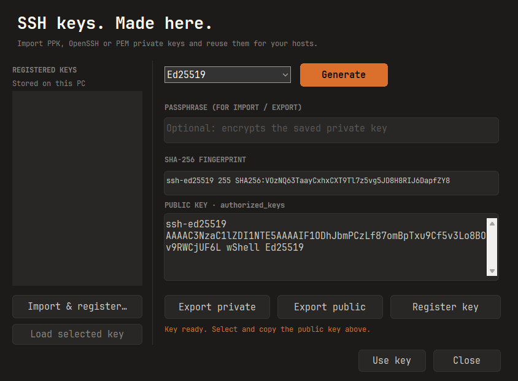

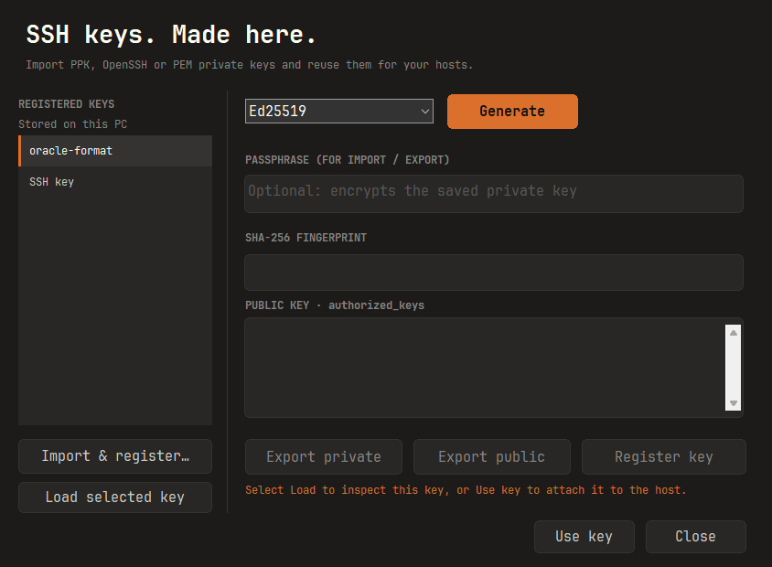

## SSH 비밀번호 저장

`New host` 또는 `Edit host`에서 `Authentication → Password`를 선택합니다. 기본값은 연결할 때 입력하는 방식입니다.

1. 서버 주소·포트·사용자 이름을 입력합니다.
2. `Save password encrypted on this PC`를 체크하고 비밀번호를 입력한 뒤 저장합니다.
3. 다음 연결부터 저장한 비밀번호를 사용합니다. 편집 시 비밀번호 칸을 비워 두면 기존 값을 유지하고, 새 값을 입력하면 교체합니다.
4. 체크를 해제하고 저장하거나 키 인증으로 전환하면 저장된 비밀번호를 삭제합니다. 호스트를 삭제해도 함께 삭제됩니다.

비밀번호는 [Windows DPAPI](https://learn.microsoft.com/en-us/windows/win32/api/dpapi/nf-dpapi-cryptprotectdata)로 현재 Windows 계정에 연결하여 암호화합니다. AppData의 세션 파일에는 암호문만 포함하며, 자식 프로세스 인수·환경변수·임시 파일로 평문을 전달하지 않습니다. 직접 지정한 `-pw` 실행 인자의 노출 범위는 위의 실행 인자 안내를 확인하세요. 서버·포트·사용자 이름에 연결해 보관하므로 연결 대상이 달라지면 다시 입력해야 합니다.

일반 SSH `password` 인증에 한 번 자동 입력하며, 거부되거나 복호화할 수 없으면 터미널에서 직접 입력합니다. 키 암호, 비밀번호 변경, keyboard-interactive/OTP 질문에는 자동 입력하지 않습니다.
**`.wshell` 내보내기·가져오기에는 암호문도 포함하지 않습니다.** 다른 PC나 Windows 계정에서는 비밀번호를 다시 저장하세요. 로그인된 동일 Windows 계정의 프로그램으로부터 비밀번호를 격리하는 기능은 아닙니다.

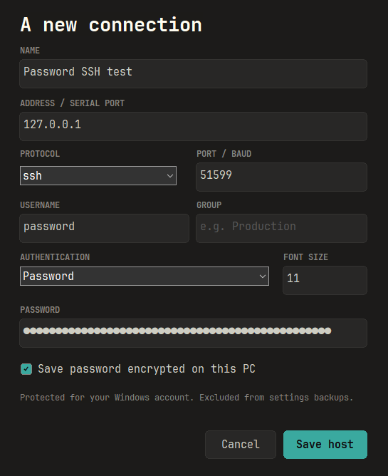

## 단축키와 컬러

| 단축키 | 동작 |
| --- | --- |
| `Ctrl+Shift+T` / 탭 줄의 `+` | 새 연결 화면 |
| `Ctrl+Shift+L` | 로컬 CMD 탭 |
| `Ctrl+Shift+D` | 현재 연결을 새 탭으로 복제 |
| `Ctrl+Tab` / `Ctrl+Shift+Tab` | 다음 / 이전 탭 |
| `Ctrl+Shift+W` | 현재 탭 닫기 |
| `Ctrl+Shift+R` | 현재 연결 다시 시작 |
| `Ctrl+Shift+H` | 왼쪽 탐색창 접기 / 펼치기 |
| `Ctrl+Shift+P` | 탐색창 펼치기 및 이름·주소 검색 |
| `Ctrl+Shift+C` / `Ctrl+Shift+V` | 터미널 복사 / 붙여넣기 |
| `Alt+1` / `Alt+2…9` | 작업 공간 / 연결 탭 1…8 |
| `F11` | 전체 화면 |

macOS: `⌘⇧L` 로컬 터미널, `⌘⇧T` 새 연결 화면, `⌘⇧D` 탭 복제, `⌘W` 탭 닫기, `⌘⇧R` 재연결, `⌘⇧[` / `⌘⇧]` 이전/다음 탭, `⌘C` / `⌘V` 복사/붙여넣기. `Tabs` 메뉴에서 탭 순서를 바꿀 수 있습니다.

터미널 종류는 `xterm-256color`이고 `COLORTERM=truecolor` 환경변수를 요청합니다.
서버가 환경변수 전달을 허용하지 않으면 원격 셸에서 `export COLORTERM=truecolor`를 설정하세요.
Codex 등 원격 TUI의 색상 자동 감지는 해당 프로그램과 서버 설정에도 영향을 받습니다.

## AppData 저장과 내보내기·가져오기

```
%LOCALAPPDATA%/wShell/  # 최초 실행 시 생성
  sessions/            # 세션 설정
  trust/               # 신뢰한 SSH 호스트 키
  cas/                 # SSH 호스트 인증기관
  workspace/           # 탐색창 표시 등 작업 공간 설정
  fonts/               # 검증된 내장 폰트 캐시, 앱에서만 사용
```

**실행에 필요한 파일은 EXE 하나이며, 설정은 현재 Windows 사용자의 AppData에 저장됩니다.** 일반적인 위치는 `C:\Users\<사용자>\AppData\Local\wShell`입니다. EXE 옆에 `data/`를 새로 만들지 않습니다. 같은 PC에서는 EXE를 옮기거나 교체해도 저장한 서버 목록을 그대로 사용합니다.

1. `Tools → Export settings…`에서 `.wshell` 백업을 저장합니다.
2. 다른 PC에 EXE와 백업을 가져간 뒤 `Tools → Import settings…`로 복원합니다.
3. 현재 저장 위치는 `Tools → Open AppData folder`에서 확인합니다.

**비밀번호는 Export/Import로 옮겨지지 않습니다. 암호화된 비밀번호도 백업에서 제외되며, 가져온 호스트의 비밀번호는 다시 입력해야 합니다.** 파일 선택 화면과 완료 안내에도 이를 표시합니다.

백업에는 세션·신뢰한 호스트 키·호스트 인증기관이 포함됩니다. 가져오기는 기존 이름의 세션이나 기존 호스트 키를 덮어쓰지 않습니다. 신뢰할 수 있는 백업만 가져오고 연결 전에 설정을 확인하세요.
이전 버전의 EXE 옆 `data/`가 있으면 최초 전환 시 AppData로 한 번 가져옵니다. 원본 폴더와 AppData의 기존 항목은 보존하며, 이후에는 AppData만 사용합니다. 이미 EXE만 이동했다면 이전 버전에서 내보낸 백업으로 가져올 수 있습니다.
설정은 기존 PuTTY 레지스트리와 분리됩니다.
SSH 비밀번호는 선택한 호스트에 한해 암호화해 저장하고 백업에서는 제외합니다. 프록시 암호는 저장하지 않으며, 개인키 파일은 복사하지 않고 경로만 참조합니다.
장치를 옮길 때는 개인키를 별도로 이동하고 경로를 다시 지정해야 할 수 있습니다. 설정 폴더와 `.wshell` 백업은 암호화된 비밀 저장소가 아닙니다.
테스트 또는 별도 데이터 위치에는 `WOOK_DATA_DIR` 환경변수를 사용할 수 있습니다.

macOS는 `~/Library/Application Support/wShell/`의 `settings.json`과 `known_hosts`에 저장합니다. 저장 비밀번호는 Keychain에 별도로 보관하며 `.wshell` 백업에서는 제외됩니다. 호스트 편집 시 비밀번호를 비워 두면 같은 접속 대상의 기존 값을 유지합니다. 저장 체크를 해제하거나 공개키 인증으로 바꾸면 저장 비밀번호를 삭제합니다.

## 개발 및 검증

### 추가 접속을 기존 창의 새 탭으로 열기 (0.14.0 개발 빌드)

0.14.0부터 같은 Windows 로그온 세션·권한 수준·데이터 폴더로 실행한 추가 SSH 접속은 기존 wShell 창의 새 탭으로 열립니다. 같은 서버를 다시 클릭해도 새 탭을 만듭니다. 접속 인자 없이 재실행하면 기존 창을 표시하며, 최소화된 창은 복원합니다. `--help`, `--preview`와 내부 터미널 프로세스는 전달 대상에서 제외합니다. 이전 버전의 창은 이 기능을 지원하지 않으므로 교체 전에 종료하세요.

실행파일과 ZIP 내부 파일 이름은 항상 **`wShell.exe`**로 제공합니다. 기존 창의 새 탭으로 여는 기능은 일반 명령줄·바로가기·외부 프로그램 연동에 공통으로 적용되며 NGS 전용 기능이 아닙니다.

**선택 사항 — NGS 연동:** NGS 7.0.13.10 사용자 환경에서는 새 프로그램 등록이나 경로만 교체했을 때 인자가 전달되지 않았고, wShell 복사본을 기존 PuTTY 경로에 `putty.exe`라는 이름으로 배치했을 때 접속 인자가 전달되는 것을 확인했습니다. 같은 문제가 있는 환경에서만 사용자가 원본 PuTTY를 백업하고 `wShell.exe`의 별도 복사본을 해당 이름·경로에 배치하세요. 이름을 바꾼 파일을 별도로 배포하거나 빌드 과정에서 자동 생성하지 않습니다. 이는 해당 환경의 관찰 결과이며 NGS 전체 버전의 공식 연동 명세를 뜻하지 않습니다. wShell의 창 공유는 실행파일 이름·설치 폴더에 의존하지 않습니다.

추가 실행 프로세스는 같은 로그온 SID만 접근 가능한 로컬 Named Pipe로 요청을 전달하고 종료합니다. 데이터 폴더와 프로세스 권한 수준이 다르면 별도 창을 사용합니다. 암호는 추가 명령줄·로그·평문 파일에 기록하지 않으며, 기존 창에서 기존의 일회용 DPAPI 암호 처리를 적용합니다. NGS가 최초 실행 명령줄에 넣은 `-pw`의 노출 가능성은 그대로입니다. 전달 실패 시 명시적인 오류를 표시하고 자동 재전송하지 않습니다. 확인 응답이 유실되었다는 오류라면 기존 창을 확인한 뒤 재시도하세요.

Linux에서 EXE·테스트 EXE 교차 빌드와 정적 패키지 검사를 수행했습니다. **Windows IPC 실행 테스트와 NGS 실기 검증은 아직 수행하지 않은 개발 빌드**입니다. Windows에서는 `scripts/build.ps1`의 CTest에 포함된 `launch-relay` 검사와 `node tests/ssh/launch-integration.cjs`를 실행하세요. 검사 범위는 동시 실행·시작 중 전달·종료 후 재시작·데이터 폴더 분리·Unicode 암호·`putty.exe` 이름·두 SSH 서버의 기존 창 탭 접속입니다. 실제 NGS에서 두 서버를 차례로 클릭하여 창 하나에 탭 두 개가 생기고 각각 로그인되는지도 확인해야 합니다.

### Linux에서 Windows 교차 빌드

Linux x86_64에서도 Windows EXE와 ZIP을 만들 수 있습니다. Python 3.12 이상과 인터넷 연결이 필요하며, 컴파일러 실행에는 `GLIBCXX_3.4.30`을 제공하는 호환 libstdc++가 필요합니다. 현재 Rocky Linux 9 / glibc 2.34 환경에서 아래 호스트 런타임 설정으로 검증했습니다. 아래 명령은 고정 버전·SHA-256으로 검증한 LLVM-MinGW, CMake, Ninja와 PuTTY 소스를 `.tools/`, `.deps/`에 준비합니다. 시스템 전역에 컴파일러를 설치하지 않습니다.

```sh
python3 scripts/build-windows-linux.py --bootstrap
# 이후 변경 빌드 (다운로드 생략)
python3 scripts/build-windows-linux.py
# 빌드 병렬 작업 수 제한
python3 scripts/build-windows-linux.py --jobs 4
```

EXE·ZIP·SHA-256은 `build/packages/<VERSION>/windows-x64/`에 생성됩니다. 기존 `dist/` 배포 파일과 manifest를 덮어쓰지 않습니다. 중간 빌드는 `build/windows-linux/`이며 Windows 테스트 실행파일도 함께 컴파일합니다. EXE의 x64 형식, DLL 의존성, ZIP 무결성, 내장 폰트·라이선스·아이콘은 Linux에서 정적으로 검사합니다.

**이 명령은 Windows 실행 테스트를 수행하지 않습니다.** SSH·UI·IME·DPAPI 등의 실제 동작 검증은 Windows에서 별도로 수행해야 합니다. Linux 빌드 성공을 Windows 회귀 테스트 통과나 새 버전 배포 완료로 취급하지 않습니다. Windows와 Linux 빌드는 생성 리소스와 PuTTY 소스를 공유하므로 같은 checkout에서 동시에 실행하지 마세요.

현재 Rocky Linux 9 환경에서는 기본 libstdc++에 `GLIBCXX_3.4.30`이 없어, 기존 `/root/miniconda3/lib/libstdc++.so.6`를 `.tools/linux-host-libs/libstdc++.so.6`에 심볼릭 링크로 연결했습니다. 빌드 스크립트는 이 선택적 디렉터리를 자식 빌드 프로세스의 `LD_LIBRARY_PATH`에 추가합니다. Windows EXE에 이 Linux 라이브러리를 포함하지 않습니다. 다른 PC에서 같은 오류가 발생하면 그 PC의 호환 libstdc++를 해당 디렉터리에 연결하세요. 현재 서버의 경로를 다른 PC에 그대로 적용하지 마세요.

```sh
python3 -m unittest discover -s tests -p 'test_*.py'
```

위 명령은 배포 무결성 검사와 PE 리소스 판독기의 정상·손상 입력 회귀 테스트를 실행합니다.

### Windows에서 빌드와 실행 검증

빌드 환경은 Windows x64, Python 3.10 이상, PowerShell입니다. C++ 컴파일러·CMake·Ninja·PuTTY 소스는 다음 명령이 저장소 내부로 다운로드하고 SHA-256을 확인합니다.

```powershell
powershell -NoProfile -ExecutionPolicy Bypass -File scripts/build.ps1 -Bootstrap
# 이후 변경 빌드, 핵심 테스트, 배포 ZIP 생성
powershell -NoProfile -ExecutionPolicy Bypass -File scripts/build.ps1
```

이 명령은 현재 PC에서 실행하며 GitHub Actions 사용 시간을 소비하지 않습니다. 결과는 `dist/<VERSION>/windows-x64/`에 생성합니다. 새 버전 배포 시 `VERSION`을 올리고 소스를 먼저 커밋한 뒤 빌드·검증하여, 기존 배포 파일을 덮어쓰지 않고 새 버전 폴더를 커밋·푸시합니다. GitHub-hosted CI는 현재 수동 실행 전용입니다.

실제 SSH 및 네이티브 UI 통합 테스트에는 개발용 Node.js 22 이상이 추가로 필요합니다.
테스트가 자체 창을 잠시 열고 루프백 서버에 연결합니다. 외부 서버·사용자 키·실제 접속 데이터는 사용하지 않습니다.

```powershell
npm --prefix tests/ssh ci --ignore-scripts --omit=optional
node tests/ssh/font-integration.cjs
node tests/ssh/launch-integration.cjs
node tests/ssh/key-import-integration.cjs
node tests/ssh/integration.cjs
node tests/ssh/sftp-integration.cjs
python -m unittest discover -s tests -p test_release.py
python scripts/index-dist.py --catalog-only # 배포 해시·manifest 확인과 다운로드 목록 갱신
git diff --check
```

분할 포커스만 빠르게 재검증하려면 빌드 후 `node tests/ssh/focus-integration.cjs`를 실행합니다. 전체 UI 통합 테스트에도 같은 검증이 포함됩니다. 이 테스트는 자체 창을 전경으로 가져와 실제 마우스·키보드 입력, 명령창에서의 포커스 복귀, 커서·테두리 깜빡임을 검사합니다. 실행 중에는 테스트 창의 입력이 끝날 때까지 기다려 주세요.

아래 macOS 절차는 해당 플랫폼을 명시적으로 요청받았을 때 사용합니다. CI에서는 `Desktop builds`를 수동 실행하면서 `build_macos`를 선택해야 macOS 작업이 실행됩니다. `iPad personal preview`도 수동 실행 전용입니다.

macOS 빌드는 macOS 13 이상, Xcode Command Line Tools와 Swift 6 이상, Python 3에서 실행합니다. Swift 의존성은 정확한 커밋과 `mac/Package.resolved`로 고정합니다.

```sh
python3 scripts/build-mac.py       # Swift 테스트, 두 아키텍처 빌드, 앱 번들/아이콘/서명/ZIP 검증
npm --prefix tests/ssh ci --ignore-scripts --omit=optional
node tests/ssh/mac-integration.cjs # AppKit, 로컬 PTY, 실제 공개키/Keychain 암호 SSH
python3 scripts/index-dist.py      # 현재 버전의 배포 manifest 생성
```

`src/`는 Windows UI·설정 저장소, `patches/`는 PuTTY 통합, `mac/Sources/WShell/`은 AppKit UI, `mac/Sources/WShellCore/`는 macOS 설정·인증·백업, `tests/`와 `mac/Tests/`는 테스트, `scripts/`는 빌드/패키징, `rules/`는 개발 규칙입니다.
기존 `AGENTS.md`는 보존하며 최신 구현 규칙은 [rules/development.md](rules/development.md)에 기록합니다.
자동 포맷터나 수치형 커버리지 기준은 아직 없습니다. 기능 변경에는 해당 동작의 회귀 검증을 추가하세요.

검증 범위: 주소/인수 처리, 한글 설정, 파일 잠금·손상, 설정 백업·복원과 기존 데이터 이전, 기존 호스트 키 보존, 세 종류의 키 생성·암호화 저장·잘못된 암호 거부, 암호화된 OpenSSH 키 변환, 실제 SSH 암호/공개키 인증, 저장된 비밀번호의 암호화·대상 확인·변조 거부·백업 제외·삭제, 비밀번호 세션 복제·재연결·수동 입력 전환, 호스트 키 거부·저장, GUI SSH 입출력·리사이즈, 탭 전환·복제, 컬러/한글 화면, 연결 설정 전체 페이지의 글꼴·폭·검색·스크롤과 변경 저장, 세션 설정의 적용·취소, 호스트 인증기관 저장.
UI 검증은 **EXE만 복사한 빈 폴더**에서 시작하며 내장 폰트·브랜딩과 같은 EXE로 실행되는 탭을 확인합니다. 패키징 시 단일 파일 ZIP, x64 시스템 DLL 의존성, 7개 해상도 아이콘, 내장 폰트·라이선스도 검사합니다.
하드웨어 Serial, 실제 프록시/GSSAPI/X11 구성, 원격 Codex 화면 전체는 환경별 실기 검증이 남아 있습니다.
분할 비율 드래그 조정, 클라우드 동기화는 제공하지 않습니다. `plink`·`pscp`·`psftp` 등 별도 CLI 실행파일도 배포하지 않습니다.

## 라이선스와 출처

자체 코드와 wShell 브랜딩 자산은 [MIT License](LICENSE)로 배포합니다.
PuTTY·SwiftTerm·Flexoki는 MIT, JetBrains Mono는 SIL OFL 1.1이며 정적으로 연결한 런타임 고지도 포함합니다.
원문 및 버전/수정 범위는 [THIRD_PARTY_NOTICES.md](THIRD_PARTY_NOTICES.md), 이미지 생성 기록은 [assets/branding/README.md](assets/branding/README.md)를 참고하세요.
재배포에 필요한 라이선스 원문은 EXE에 내장되어 있으며 `Tools → Open-source licenses`에서 읽을 수 있습니다.

PuTTY 기반 엔진은 **공식 배포본이 아닌 수정 빌드**입니다. 이 프로젝트는 PuTTY, Termius, JetBrains와 제휴 관계가 없으며 Termius의 독점 폰트나 이미지를 포함하지 않습니다.
