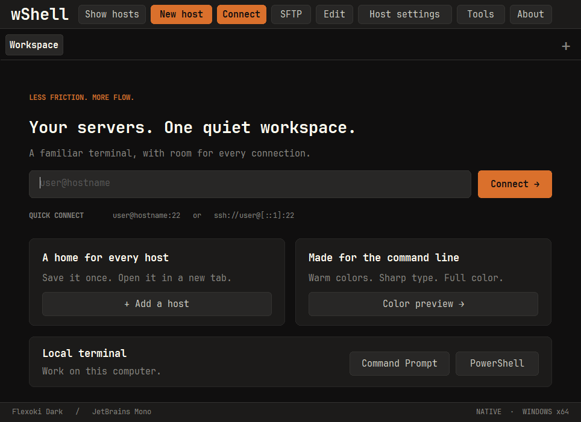

# wShell 0.10.0

Windows now keeps saved-host actions in a fixed top bar and lets you reclaim the navigation space for terminals.

- **Hide hosts / Show hosts** and `Ctrl+Shift+H` toggle the left navigation. The preference survives restarts. Split panes, active input, command drafts and sync targets are preserved.
- **New host, Connect, SFTP, Edit, Host settings, Tools and About** stay at the top. Tooltips identify the selected saved connection; session actions remain beside the active terminal.
- `Ctrl+Shift+P` reveals and focuses search. **Name, alias, address…** describes the search more accurately; names, aliases, addresses, groups and usernames are all searchable. Empty searches disable actions that need a selected connection.
- Embedded JetBrains Mono files are verified and cached in `%LOCALAPPDATA%\wShell\fonts`, then registered privately in each process. Windows font selection can validate the typeface and change its size without a system font installation or download. The distribution still contains only `wShell.exe`.
- New Windows terminals and hosts start at **9pt**. Existing saved sizes and the UI text scale are preserved.

Regression coverage checks the native font picker with no preinstalled JetBrains Mono, cached resource bytes, both font weights, cache reuse/repair and eight simultaneous processes, persistent navigation preferences, minimum-width toolbar layout, search fields and actual keyboard focus after toggling navigation from a split terminal. Existing SSH, SFTP, settings, IME, split and broadcast checks remain in place.

These UI and default-size changes apply to Windows. macOS and iPad retain their existing layouts and defaults. The implementation contract is documented in [workspace UI rules](../../rules/workspace-ui.md).

