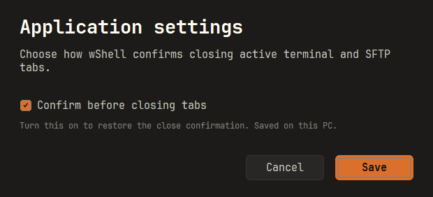

# wShell 0.13.0 — Windows

## 변경 사항

- SFTP의 로컬·원격 탐색기 사이에 `>` 업로드와 `<` 다운로드 버튼을 배치했습니다. 원본 파일을 선택하면 해당 버튼이 주황색으로 활성화되고 전송 중에는 양쪽이 비활성화됩니다. 버튼의 이름·툴팁으로 방향을 설명합니다.
- 탭 닫기 확인의 기본 선택을 **Close**로 바꿨습니다. **Don't ask again when closing tabs**를 체크하고 닫으면 다음 개별·일괄 닫기부터 확인을 생략합니다. 취소하면 탭과 설정을 보존합니다.
- **Tools → Application settings → Confirm before closing tabs → Save**로 확인을 복원합니다. 설정은 다음 실행에도 유지됩니다. 앱 전체 종료 확인은 별도입니다.
- 지정한 탭 색상을 상단 전체 색상 띠와 배경에 표시합니다. 활성 탭은 주황색 외곽선·하단 표시와 굵은 이름으로 구분합니다.
- 버전별 `release` 실행파일·ZIP·SHA-256·manifest를 Git에 보관합니다. [다운로드 목록](../../release/README.md)에서 현재·이전 버전을 받을 수 있고 새 manifest의 소스 커밋과 CI 링크로 빌드를 추적합니다.

## 검증 범위

- CTest의 핵심 모델·저장소, IME, SFTP 코덱 테스트와 배포 EXE의 내장 자산·시스템 DLL 의존성 검사.
- 작은 창·큰 창의 탭 색상 및 SFTP 버튼 배치, 전송 가능 상태, 실제 업로드·다운로드 바이트 일치.
- 닫기 확인 기본 포커스, 확인 생략·복원·취소, 모달 창에서 탭이 바뀌어도 원래 대상만 닫기, 설정 저장 후 재읽기.
- 독립 루프백 SSH 서버의 인증·분할 입력·SFTP, 폰트 캐시, 실행 인자, 개인키 등록 회귀 검사.
- 배포 검증기의 손상 해시·다른 EXE·잘못된 압축 내용·키 파일 차단과 기존 manifest 보존 테스트.

각 배포의 최종 CI 실행은 [`manifest.json`](../../release/0.13.0/manifest.json)의 `workflow`에서 확인합니다. 실제 OS 한글 입력기 수동 검증과 합성 IME 테스트는 구분합니다. 사용자 서버에는 테스트 파일을 쓰지 않습니다.

## 배포

[`wShell.exe`](../../release/0.13.0/windows-x64/wShell.exe) 또는 [ZIP](../../release/0.13.0/windows-x64/wshell-0.13.0-windows-x64.zip)을 받습니다. ZIP 안에는 EXE 하나만 있습니다. Windows 10 1903 이상·Windows 11 x64용이며 코드 서명은 없습니다.

macOS·iPad는 새로 빌드하지 않았습니다. 다운로드 목록에 보관한 macOS 0.11.0과 unsigned iPad 0.1.0은 이전 기능 그대로이며 iPad 파일은 별도 서명이 필요합니다.
