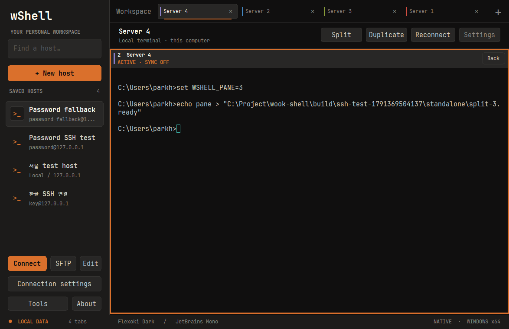

# wShell 0.9.0

Windows split terminals now make the active pane and input destinations explicit.

- An orange frame and **ACTIVE** label distinguish focus from host identity colors. Inactive panes use subdued frames; headings identify sync and exclusion states.
- **Sync keyboard** returns focus to the active terminal. Navigation/editing keys use each destination's native PuTTY translation, so normal and application cursor modes receive the correct escape sequences. Text, committed IME input and paste remain synchronized without duplicate sends.
- **Targets** lets you exclude individual visible panes from both **Send to targets** and live input. Excluded panes remain independently usable. Ready/delivery counts are shown separately from selection counts.
- **Zoom / Back** preserves the original split group. Broadcast modes stop on zoom, restore, reconnect or group changes.
- **Ctrl+Alt+Arrow** moves between neighboring panes. **Ctrl+Shift+Enter** zooms/restores, **Ctrl+Shift+B** toggles keyboard sync, and **Ctrl+Shift+K** focuses the command field.
- **Files** is the leftmost session action, leaving no hole between controls in local CMD/PowerShell tabs.

The additions adapt selected-session input from [SecureCRT's command window](https://www.vandyke.com/support/scripting/scripting-examples/command-window-automation.html), per-session input exclusion from [Xshell](https://netsarang.atlassian.net/wiki/spaces/KRSUP/pages/1141080152), and reversible focus/split views from [Termius Workspaces](https://termius.com/blog/workspaces-focus-without-losing-context). No third-party product assets or code are included.

Keyboard sync sends input, not absolute cursor coordinates or editor state. Use the same starting content and editor mode for coordinated editing. Command-field arrows edit the local draft; turn on sync and type inside a target terminal for live editing. Hidden tabs, SFTP, previews and unauthenticated sessions remain excluded. Commands are not stored as history.

These additions are Windows-only. macOS retains its existing split/broadcast features; iPad remains a separate personal preview.

Validation covers non-cancelling CMD cursor edits, exact normal/application-mode SSH key streams, Unicode paste, selected/hidden target isolation, pane navigation and zoom, alongside the existing core, IME, SSH authentication/settings and SFTP suites. The SFTP fixture now closes server connections using the supported `end()` API.

See [split-view usage](../split-view.md). Created by **Hyunwook Park**.

