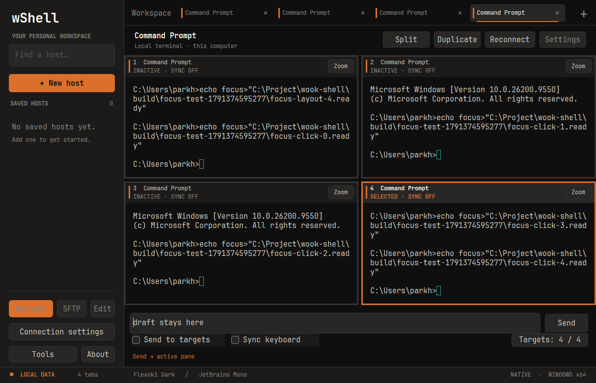

# wShell 0.9.1

Windows split terminals now take keyboard focus immediately after choosing a layout or clicking a terminal body. Returning from the bottom command field works even when the clicked pane was already selected, and the command draft is preserved.

- Restore terminal focus after choosing 2/3/4 panes or returning to a single pane.
- Acquire focus on terminal mouse-down before processing selection, paste or remote mouse input.
- Use the workspace foreground window and the actual child keyboard focus for PuTTY's idle cursor check. This keeps the focused cursor blinking instead of reverting to an inactive cursor between messages.
- Pulse the focused pane's orange border slowly between two visible shades. Pause when the command field, another control or another application has focus. Respect the Windows setting that disables cursor blinking.
- Show **ACTIVE** for the keyboard owner and **SELECTED** for a command destination without keyboard focus. Ignore stale focus notifications after rapid changes.

Regression coverage uses native `SendInput` and shell-created files after each layout and after returning from the command field to all four panes, including the already-selected pane. Pixel sampling checks cursor and border animation while idle and verifies that both stop when focus leaves the terminal. The existing split, zoom, broadcast, SSH, SFTP, settings and IME tests remain in place.

These changes apply to Windows. See [split-view usage](../split-view.md) and the [0.9.0 features](0.9.0.md).

