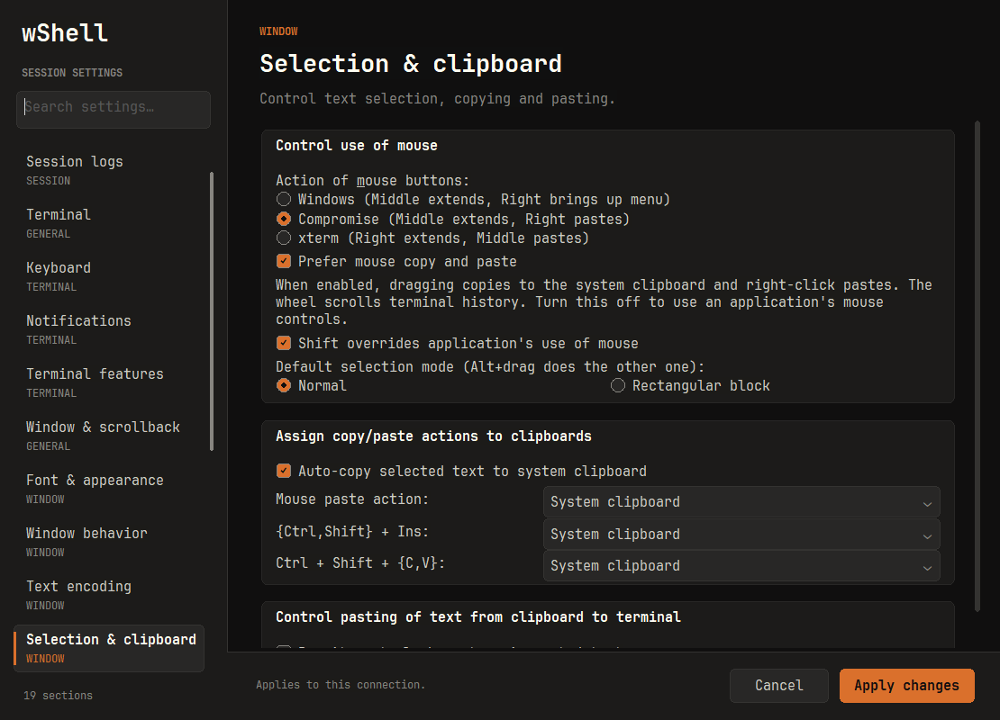

# 1.0.1 — 터미널 마우스 복사·붙여넣기 우선

Windows에서 Codex CLI 같은 원격 프로그램이 마우스 보고 모드를 켜면 일반 드래그·우클릭이 서버로 전달되어 복사·붙여넣기가 동작하지 않던 사용성을 개선했습니다.

- 기본값은 **일반 드래그로 선택·자동 복사, 우클릭으로 붙여넣기**입니다. 원격 앱의 마우스 요청보다 시스템 클립보드를 우선합니다.
- `Settings → Selection & clipboard → Prefer mouse copy and paste`로 현재 연결에 즉시 적용합니다. 호스트별 기본값은 `Host settings`에서 저장합니다. 새 설정 키가 없는 이전 저장 연결도 새 기본값을 사용하며, 명시적으로 끈 값은 유지합니다.
- 기본 모드의 휠은 터미널 기록을 스크롤합니다. Codex·vim·tmux 같은 원격 앱의 마우스 클릭·드래그·휠 기능이 필요하면 이 설정을 끄세요. 기존 마우스 설정이 다시 적용되며 Shift 조합으로 복사·붙여넣기를 할 수 있습니다.
- 여러 줄·한글 붙여넣기의 bracketed paste와 Ctrl+우클릭 메뉴를 유지합니다.
- EXE는 미서명입니다. macOS·iPad는 새로 빌드하지 않았습니다.

## 검증

- 변경 전 마우스 보고 모드에서 일반 드래그 복사가 되지 않는 경우를 테스트로 재현했습니다. 변경 후 기본 모드와 명시적으로 해제한 모드 모두 통과했습니다.
- 실제 루프백 SSH와 Windows 클립보드로 선택 내용, 우클릭 한글 붙여넣기의 단일 전송, Shift override, 마우스 모드 진입·종료, 다른 입력칸에서 터미널로 돌아오기와 설정 화면의 즉시 적용을 검증했습니다.
- 이 마우스 검사는 터미널 HWND에 Win32 메시지를 보내는 자동 테스트입니다. 사용자의 원격 서버나 Codex CLI 자체를 실행한 검증은 아닙니다.
- Windows 로컬 Release 빌드, CTest 4개, Python 테스트 13개, 폰트 캐시, 실행 인자·기존 창 전달, 개인키 가져오기·실제 SSH 서명 검증 통과.
- 설정 화면 32개 페이지의 자동 검사와 새 마우스 설정 화면의 이미지 확인을 완료했습니다.
- 전체 SSH/UI 통합 테스트는 **미통과**입니다. 기존 1.0.0과 같이 phase 34의 `Native click must hit the test window, never another application`에서 중단됐습니다. OS의 실제 클릭·키보드 포커스 검증은 완료하지 못했으며, 안전 검사를 생략하지 않았습니다.
- NGS 환경 수동 검증은 수행하지 않았습니다.

## 다운로드

[wShell.exe](../../release/1.0.1/windows-x64/wShell.exe) · [ZIP](../../release/1.0.1/windows-x64/wshell-1.0.1-windows-x64.zip) · [manifest](../../release/1.0.1/manifest.json)
