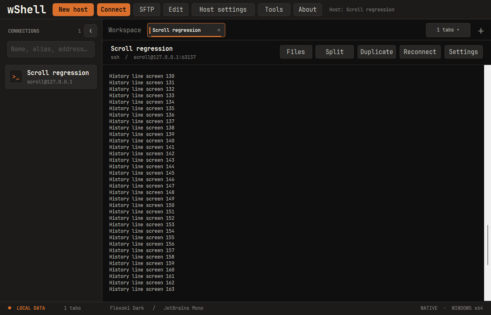

# 1.0.2 — 출력 중 스크롤 위치 유지와 마우스 이동 보고 보정

Codex CLI처럼 화면을 계속 갱신하는 프로그램에서 휠로 위 기록을 읽으면 다시 맨 아래로 내려가던 문제를 수정했습니다. 1.0.1의 복사·붙여넣기 우선 처리와 별개로, 엔진의 출력 시 스크롤 초기화 기본값이 켜져 있던 것이 원인이었습니다.

- **위 기록을 읽는 동안 새 출력이 와도 같은 위치를 유지**합니다. 맨 아래로 내려가면 다시 새 출력을 계속 따라갑니다.
- 이전 저장 연결에도 새 기본값을 적용합니다. 항상 최신 출력으로 이동하려면 `Settings → Window & scrollback → Reset scrollback on display activity`를 켜고 적용하세요. 다음 연결의 기본값은 해당 호스트의 `Host settings`에서 저장합니다.
- 이 설정은 엔진의 기존 스크롤 처리와 UI를 사용합니다. 저장 키를 `WookScrollOnDisp`로 구분해 이전 `ScrollOnDisp=1` 기본값을 물려받지 않으며, 새로 명시한 선택은 유지합니다. 사용자의 설정 파일을 일괄 변경하지 않습니다.
- 앱 마우스 모드에서 **Shift를 누른 포인터 이동**에도 마우스 override를 적용합니다. 이전에는 클릭·드래그와 달리 버튼 없는 이동에 Shift 상태가 전달되지 않았습니다.
- `35;68;23M` 같은 값은 마우스 이동 보고가 입력으로 남은 형태입니다. 기본 복사·붙여넣기 우선 모드는 1.0.1부터 보고 자체를 차단하며, 이번에는 앱이 마우스 모드를 남기고 종료한 경우까지 검증했습니다. 실제로 입력한 비슷한 문자열은 지우지 않습니다. [xterm 마우스 보고 명세](https://invisible-island.net/xterm/ctlseqs/ctlseqs.html)
- 원격 앱의 자체 스크롤 기록을 새로 만드는 기능은 아닙니다. 휠은 wShell에 보관된 터미널 기록을 이동합니다.
- 업데이트 시 **기존 wShell 창을 모두 종료한 뒤 새 EXE를 실행**하세요. 기존 창이 남아 있으면 추가 실행이 그 창으로 전달될 수 있습니다.

## 검증

- 변경 전 1.0.1 코드에서 스크롤 위치가 출력 후 131→156(맨 아래)으로 이동하는 것을 재현했습니다. 변경 후에는 131을 유지하고, 자동 이동을 명시적으로 켠 경우에는 156으로 이동합니다.
- 루프백 SSH의 연속 출력, 휠의 부분 입력 누적, 맨 아래로 복귀한 뒤 출력 따라가기, 대체 화면의 커서 이동·다시 그리기를 두 설정 모드에서 검증했습니다.
- 마우스 회귀는 기본 모드와 앱 마우스 모드에서 각각 통과했습니다. 일반·Shift 드래그, 한글 우클릭 붙여넣기, bracketed paste 단일 전송, 설정 즉시 적용, 버튼 없는 이동, 정상 모드 종료·마우스 모드 잔류를 포함합니다.
- 위 검사는 터미널 HWND에 Win32 메시지를 보내는 자동 테스트입니다. 사용자의 원격 서버나 Codex CLI 자체를 실행한 검증은 아닙니다.
- Windows 로컬 빌드와 나머지 회귀 검증 결과는 배포 전 확정합니다.
- macOS·iPad 빌드와 CI는 실행하지 않았습니다. EXE는 미서명이며 NGS 수동 검증은 수행하지 않았습니다.

## 다운로드

[wShell.exe](../../release/1.0.2/windows-x64/wShell.exe) · [ZIP](../../release/1.0.2/windows-x64/wshell-1.0.2-windows-x64.zip) · [manifest](../../release/1.0.2/manifest.json)
