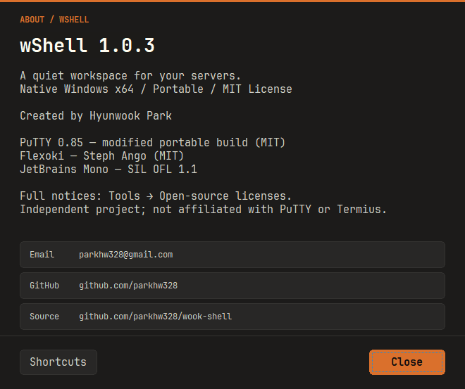
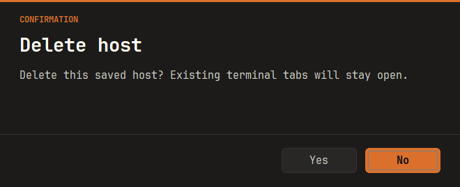

# 1.0.3 — About 연락처와 테마에 맞춘 알림·확인창

- About에 개발자 이메일 `parkhw328@gmail.com`, [GitHub 프로필](https://github.com/parkhw328), [소스 저장소](https://github.com/parkhw328/wook-shell) 링크를 추가했습니다. 클릭하면 기본 메일 앱이나 브라우저로 열립니다.
- 기본 Windows 알림·확인창을 wShell의 어두운 Flexoki 배경, 주황색 강조, JetBrains Mono 글꼴과 버튼으로 통일했습니다. 연결 오류, 삭제·덮어쓰기 확인, SSH 엔진의 보안 경고에도 적용합니다.
- 기존 기본 버튼과 Enter·Esc 동작을 유지합니다. 긴 메시지는 선택·복사하고 휠이나 스크롤 손잡이로 읽을 수 있습니다.
- SSH 호스트 키 창은 지문·변경 경고·상세 정보를 유지합니다. 기본 선택은 Cancel이며 Accept만 키를 저장합니다. Connect Once는 해당 연결에만 적용됩니다.
- About의 버전·라이선스 정보와 단축키 안내를 정리했습니다.
- 업데이트할 때는 기존 wShell 창을 모두 종료한 뒤 새 EXE를 실행하세요.

## 검증

- 격리된 자동 테스트에서 About 링크 대상, 기본 버튼·Enter·Esc·닫기, 소유 창과 중첩 모달, 긴 한글 본문·휠·스크롤 손잡이, 150% DPI 변경을 확인했습니다.
- 실제 루프백 SSH 서버로 Cancel은 인증하지 않음, Connect Once는 저장 없이 연결, Accept만 키 저장을 검증했습니다.
- 위 UI 검사는 Win32 메시지를 사용합니다. 실제 OS 키보드·마우스 입력 라우팅과 서로 다른 모니터 사이 수동 이동 검증을 대신하지 않습니다.
- 최종 배포 빌드 및 회귀 검증 결과는 배포 전에 기록합니다.

## 다운로드

[wShell.exe](../../release/1.0.3/windows-x64/wShell.exe) · [ZIP](../../release/1.0.3/windows-x64/wshell-1.0.3-windows-x64.zip) · [manifest](../../release/1.0.3/manifest.json)
