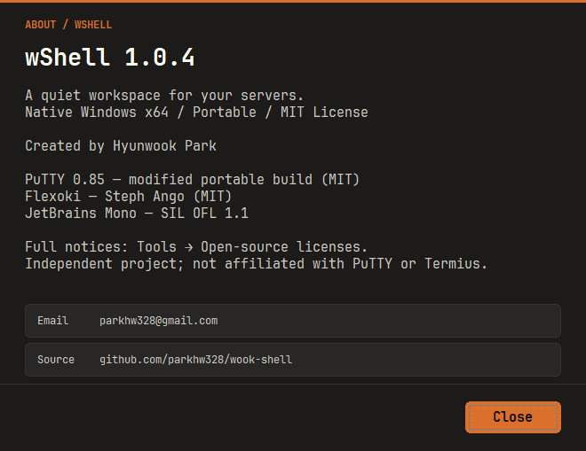
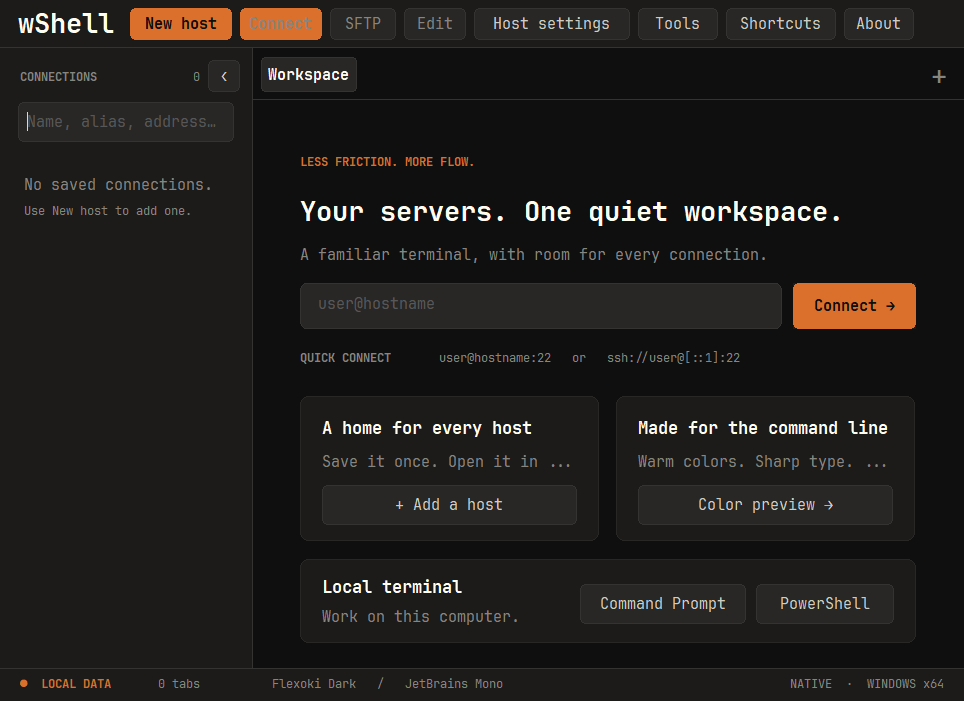
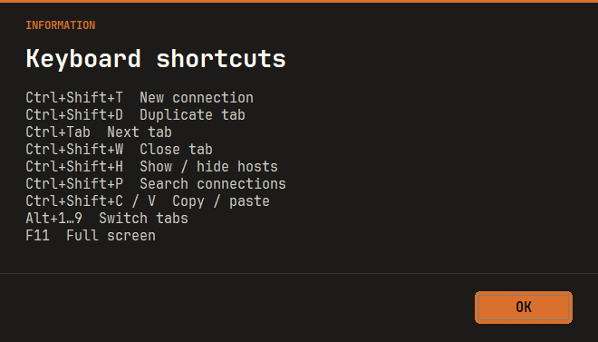

# 1.0.4 — About 정리와 독립 Shortcuts 버튼

- About의 중복 GitHub 프로필 링크를 제거하고 Email·Source만 남겼습니다.
- 단축키 안내를 상단 About 바로 왼쪽의 **Shortcuts** 버튼으로 옮겼습니다. About 내부에는 중복 버튼을 두지 않습니다.
- 최소 창 크기에서도 상단 버튼과 선택한 호스트 안내가 겹치지 않도록 배치했습니다.
- 1.0.3의 테마 알림·확인·SSH 보안 경고와 기존 마우스·스크롤 수정을 포함합니다.
- 기존 wShell 창을 모두 종료한 뒤 새 EXE를 실행하세요.

## 검증

- 최종 Windows Release 빌드, 대화상자 검사 185개, CTest 4개와 Python 테스트 13개 통과. EXE 버전·내장 리소스·ZIP 일치·SHA-256·manifest를 확인했습니다.
- 폰트 캐시, 실행 인자·기존 창 전달, 개인키 가져오기·실제 SSH 서명 검사 통과. 최소 창 크기의 Shortcuts 배치·버튼 클릭·닫기 후 포커스, About의 두 링크와 중복 항목 제거를 검증하고 1.0.4 화면을 확인했습니다.
- 마우스 기본·앱 우선 모드, 출력 중 스크롤 위치 유지·자동 따라가기 두 설정의 회귀 검사도 통과했습니다.
- UI 검사는 격리된 Win32 메시지와 루프백 SSH를 사용합니다. 실제 OS 클릭·키보드 라우팅 전체 검증을 대신하지 않습니다. 전체 UI 검사는 이번 배포에서 재실행하지 않았으며, 이전 1.0.3에서는 phase 34 클릭 대상 확인에서 중단됐습니다.
- macOS·iPad와 CI는 실행하지 않습니다. EXE는 미서명이며 NGS 수동 검증은 미실행입니다.

## 다운로드

[wShell.exe](../../release/1.0.4/windows-x64/wShell.exe) · [ZIP](../../release/1.0.4/windows-x64/wshell-1.0.4-windows-x64.zip) · [manifest](../../release/1.0.4/manifest.json)
