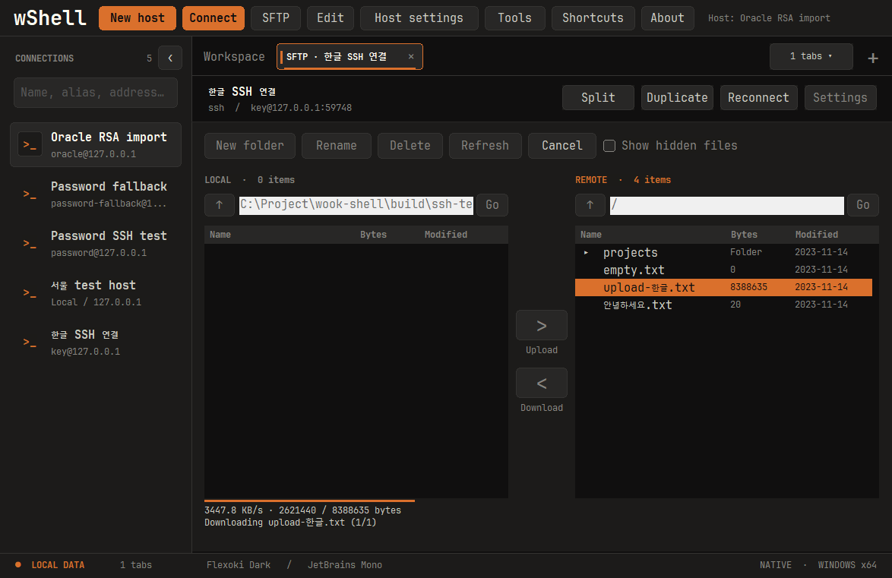

# 1.0.5 — SFTP 전송 성능·속도 표시와 목록 배경 수정

- 다운로드 요청을 16개씩 모두 기다리는 방식에서 최대 64개를 지속적으로 보충하는 방식으로 변경했습니다. 서버의 짧은 응답도 부족한 부분을 병렬로 다시 요청합니다.
- Windows 업로드·다운로드 상태에 최근 약 1초 기준 **KB/s**를 표시합니다. 파일마다 초기화하고, 전송이 멈추면 0으로 내려갑니다.
- 전송 중 로컬·원격 파일 목록의 빈 영역이 하얗게 변하던 문제를 수정했습니다. 목록을 비활성화할 때 Windows가 시스템 배경색을 사용하던 것이 원인이었습니다. 목록은 어두운 테마와 스크롤을 유지하고, 폴더 이동과 파일 작업은 계속 차단합니다.
- 기존 파일 보존, 임시 파일 교체, 취소와 응답 순서 검증을 유지합니다.
- 기존 wShell 창을 모두 종료한 뒤 새 EXE를 실행하세요.

## 성능 확인

동일한 8MB+3 bytes 파일과 응답 지연 40ms의 로컬 서버 비교에서 일반 응답은 약 2,595→4,766 KB/s, 짧은 응답은 408→5,139 KB/s였습니다. 실제 사용자 서버나 WinSCP와의 직접 비교는 아니며, 네트워크·서버·디스크에 따라 달라집니다. 재현 명령과 상세 조건은 [SFTP 문서](../sftp.md)에 기록했습니다.

## 검증

- Windows CTest 4개, Python 테스트 13개, SFTP 루프백 통합 검사와 성능 비교, 폰트 캐시 검사를 통과했습니다.
- 전체 SSH/UI 검사를 단독 실행해 SSH 검사 20개와 UI 검사 446개를 통과했습니다. 전송 중 양쪽 목록의 실제 배경색·KB/s 표시·작업 버튼 비활성화와 8MB 파일 왕복 일치를 확인하고 화면을 검토했습니다. 최초 병행 실행의 초기 포커스 검사는 실패했으나, 다른 테스트 창 없이 재실행해 전체 검사를 통과했습니다.
- 테마 대화상자 185개, 마우스 기본·앱 우선 모드 각 62개, 스크롤 유지·자동 따라가기 각 23개 검사를 통과했습니다. 실행 인자·기존 창 전달·암호 파이프와 개인키 가져오기·실제 SSH 서명 검사도 통과했습니다.
- macOS·iPad와 CI는 실행하지 않습니다. EXE는 미서명이며 NGS 수동 검증은 미실행입니다.

## 다운로드

[wShell.exe](../../release/1.0.5/windows-x64/wShell.exe) · [ZIP](../../release/1.0.5/windows-x64/wshell-1.0.5-windows-x64.zip) · [manifest](../../release/1.0.5/manifest.json)
