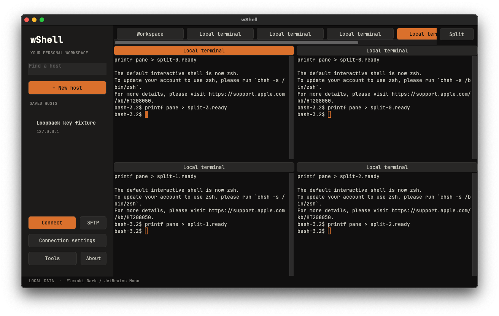

# Split view

Open at least two tabs, select a terminal, and choose **Split**:

| Layout | Arrangement |
| --- | --- |
| Single pane | Selected tab fills the workspace |
| 2 panes | Side by side |
| 3 panes | Full-height left pane, two stacked right panes |
| 4 panes | 2 × 2 grid |

The initial group contains the selected tab followed by existing tabs in tab order. Open more tabs to enable larger layouts. Choosing a layout does not create new connections or terminate any sessions.

Click a terminal or its pane heading to focus it. The orange heading/border identifies the active pane; typing, duplicate, reconnect and close commands apply to that tab. Input is **not broadcast**. Selecting a tab already visible focuses its existing pane. Selecting a hidden tab replaces only the active pane; the replaced session continues running in its tab.

**Single pane** restores the ordinary tab view. **Workspace/Home** temporarily hides the group. Closing a tab removes its pane and fills the vacancy from another existing tab when available. Tab reordering preserves pane identities. Resizing the window updates terminal rows/columns for each visible pane.

Windows: toolbar **Split**, or `Ctrl+Shift+S`. macOS: toolbar **Split**, **Tabs → Split layout**, or `⌘⇧S`. The iPad preview has a **Split** menu beside its tabs; Windows and Mac are the initial release priority.

Layouts have fixed proportions in this version; draggable dividers, persisted layouts and input broadcasting are not implemented. SFTP tabs can be displayed alongside terminals, but wide file controls are most comfortable in larger panes or single-pane mode.

